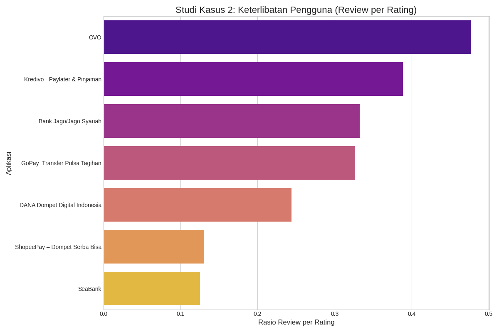

Analisis Pasar Aplikasi Fintech di Google Play Store Indonesia
Proyek ini adalah studi kasus analisis data yang bertujuan untuk memetakan lanskap kompetitif aplikasi finansial (Fintech) populer di Indonesia. Prosesnya meliputi web scraping data dari Google Play Store, pembersihan data, analisis, dan visualisasi untuk mendapatkan wawasan yang bermakna.

📊 Visualisasi & Temuan Utama
Dari data yang dikumpulkan, dihasilkan dua analisis utama:

1. Lanskap Pasar (Market Landscape)
Visualisasi ini memetakan setiap aplikasi berdasarkan jumlah instalasi (yang merepresentasikan basis pengguna) dan skor rata-rata (yang merepresentasikan kepuasan pengguna).

Temuan Kunci:

Pemimpin Pasar (Kuadran Kanan Atas): Aplikasi seperti DANA, OVO, dan GoPay mendominasi dengan jumlah instalasi yang sangat tinggi dan skor kepuasan yang solid. Mereka adalah pemain utama yang paling banyak digunakan.

Produk Unggulan (Kuadran Kanan Bawah): Aplikasi perbankan digital dan investasi seperti Jago dan Seabank memiliki skor kepuasan di antara yang tertinggi. Ini menandakan produk yang sangat disukai oleh basis penggunanya, meskipun jumlah instalasinya belum sebanyak para pemimpin pasar.

Adopsi Luas (Kuadran Kiri Atas): Aplikasi seperti Kredivo menunjukkan penetrasi pasar yang kuat dengan jumlah instalasi yang masif, meskipun skor kepuasannya mungkin sedikit di bawah aplikasi dengan produk yang lebih terfokus.

2. Keterlibatan Pengguna (User Engagement)
Analisis ini mengukur seberapa "vokal" pengguna sebuah aplikasi dengan menghitung rasio antara jumlah ulasan tertulis dan jumlah total rating. Rasio yang tinggi menandakan pengguna lebih sering meluangkan waktu untuk memberikan umpan balik detail.

Temuan Kunci:

Pengguna Paling Vokal: Aplikasi perbankan digital (Jago, Seabank) cenderung memiliki rasio tertinggi. Hal ini wajar karena interaksi pengguna dengan aplikasi ini lebih kompleks (transaksi finansial, investasi), sehingga mendorong mereka untuk berbagi pengalaman secara lebih mendetail.

Interaksi Cepat & Sederhana: Aplikasi dompet digital (e-wallet) memiliki rasio yang cenderung lebih rendah. Pengguna lebih sering memberikan rating bintang tanpa menulis ulasan karena sifat transaksinya yang cepat. Ulasan biasanya baru ditulis jika terjadi masalah.

🛠️ Teknologi & Library yang Digunakan
Python: Bahasa pemrograman utama untuk analisis.

google-play-scraper: Library untuk melakukan scraping data dari Google Play Store.

Pandas: Untuk manipulasi, pemrosesan, dan pembersihan data.

Matplotlib & Seaborn: Untuk membuat visualisasi data yang informatif.

🚀 Cara Menjalankan Proyek
Untuk menjalankan proyek ini di lingkungan lokal Anda, ikuti langkah-langkah berikut:

1. Kloning Repositori
git clone [https://github.com/cifer-renn/analisis-fintech-id.git](https://github.com/cifer-renn/analisis-fintech-id.git)
cd analisis-fintech-id

2. Buat dan Aktifkan Virtual Environment (Direkomendasikan)
# Untuk Windows
python -m venv venv
.\venv\Scripts\activate

# Untuk macOS / Linux
python3 -m venv venv
source venv/bin/activate

3. Instal Dependensi
Proyek ini memerlukan beberapa library Python.

pip install google-play-scraper pandas matplotlib seaborn

4. Jalankan Skrip
Karena file utama adalah Jupyter Notebook (.ipynb), Anda bisa membukanya menggunakan Jupyter Lab atau Visual Studio Code. Atau, konversi notebook tersebut menjadi skrip Python (.py) dan jalankan dari terminal.

📄 Sumber Data
Data diambil secara real-time dari Google Play Store Indonesia pada saat skrip dijalankan. Hasil dapat bervariasi dari waktu ke waktu sesuai dengan data terbaru yang tersedia di platform tersebut.
